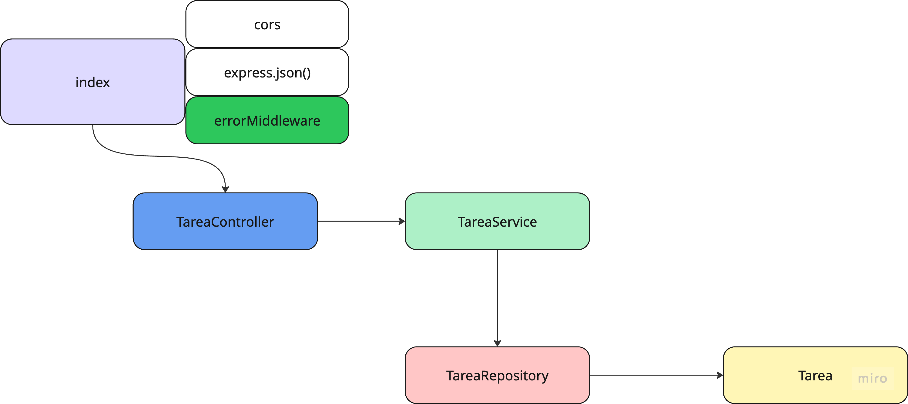
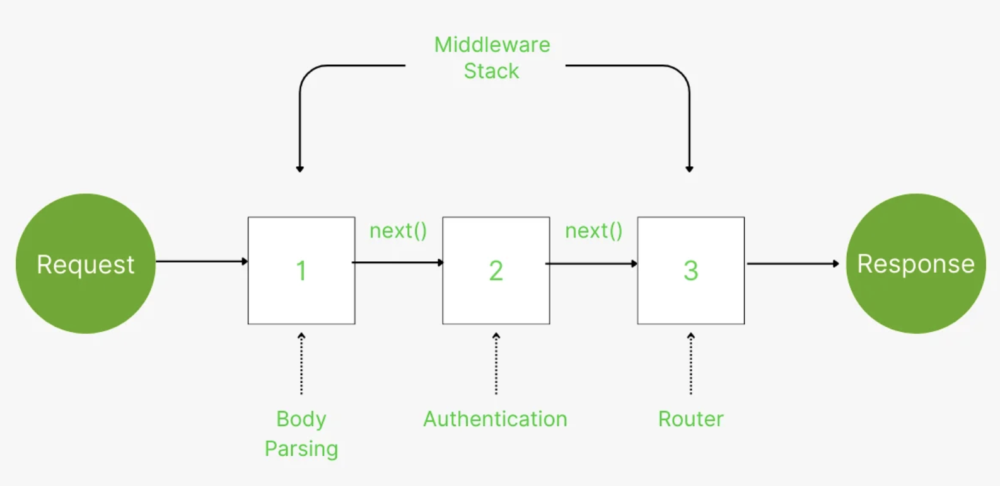

## Tareas de un equipo de desarrollo

[](https://github.com/uqbar-project/eg-tareas-node/actions/workflows/build.yml) [](https://codecov.io/gh/uqbar-project/eg-tareas-node)

## Colecciones de prueba

- [Bruno](./manualTest/Tareas_Bruno.json)
- [POSTMAN](./manualTest/Tareas_Postman.json)

## Cómo levantar el servidor

### Modo normal

Para levantar el servidor en modo normal, ejecutá:

```bash
npm run start:dev
```

### Modo debug

Para levantar el servidor en modo debug y poder establecer breakpoints:

1. Abrí el panel de debug (hacé clic en el ícono de debug en la barra lateral o presioná `Ctrl+Shift+D` / `Cmd+Shift+D`)
2. Verificá que esté seleccionada la configuración **"Debug Server"** en el menú desplegable
3. Presioná el botón de play o `F5` (en macOS puede ser `Fn+F5`)

El servidor se levantará con el debugger adjunto. Podés establecer breakpoints en el código haciendo clic a la izquierda del número de línea.

## Explicación general

En esta variante en Node agregamos servicios de paginación para lo cual, a la hora de pedir las tareas, agregamos como parámetro

- el número de la página
- y el límite de tareas por página

De esa manera, si pedimos la página 1 y el límite de 10, el servicio nos devolverá las primeras 10 tareas.
Si pedimos la página 2 y el límite de 10, el servicio nos devolverá las siguientes 10 tareas (de la 11 a la 20 si tenemos).

Como respuesta recibimos:

- el número de página
- si hay más tareas
- y la lista de tareas para dicha página

Ejemplo:

```json
{
  "page": 1,
  "hasMore": true,
  "data": [
    {
      "id": 1,
      "descripcion": "Adfectus cibo contra talus adiuvo.",
      "iteracion": "Sprint 3",
      "asignadoA": "Barbara Arroyo Montemayor",
      "fecha": "13/10/2025",
      "porcentajeCumplimiento": 48
    },
```

## Los endpoints

- Buscar tareas paginadas
- Buscar una tarea
- Actualizar una tarea: la fecha, el porcentaje de cumplimiento y el asignatario
- Buscar usuarios

## Implementación

### Arquitectura general



El index principal tiene un **middleware** de errores (explicado más abajo), el manejo de CORS para que el servidor de front pueda comunicarse con el back y la exportación de los resultados a formato json.

Luego podemos ver una estructura similar a la que podés encontrar en el ejemplo [implementado en Springboot](https://github.com/uqbar-project/eg-tareas-springboot-kotlin):

- un **controller** que tiene como finalidad adaptar el pedido http a un esquema más cómodo para trabajar con objetos, y viceversa (allí podrás ver por ejemplo cómo captura los query params del paginado)
- un **service** que orquesta las llamadas al repositorio y delega cuando es necesario la conversión a métodos de negocio (por ejemplo para transformar un objeto de dominio TS a JSON puro / DTO)
- un **repository** que funciona como un servicio de acceso a la búsqueda y actualización de los datos en un medio externo o bien en memoria.
- y nuestro **objeto de dominio**, representado tanto para las tareas como para los usuarios.

### Inyección de dependencias

Mientras que en Springboot existe la anotación `@Autowired` que crea los singletons para el controller, el service y el repository, en esta variante debemos hacerlo manualmente, generando una referencia que luego es exportada. Veamos por ejemplo el service:

```ts
class TareasService {
  async getTareaById(id: number) {
    ...
  }

  async getTareas(page: number, limit: number): Promise<PageTareas> {
    ...
  }

  async updateTarea(id: number, dto: TareaDto): Promise<TareaDto> {
    ...
  }
}

export const tareasService = new TareasService()
```

### Manejo de errores

El esquema que utiliza Node es muy similar a los filters (decorators) de Springboot, solo que en Node el nombre que recibe es **middleware**.



Veamos la función general...

```ts
export const errorMiddleware = (
  err: Error,
  req: Request,
  res: Response,
  _next: NextFunction,
) => {
  console.error(`[Error Middleware] ${err.name}: ${err.message}`)
  if (err instanceof NotFoundError) {
    return res.status(404).json({ message: err.message })
  }
  if (err instanceof DomainError) {
    return res.status(400).json({ message: err.message })
  }
  return res.status(500).json({ message: 'Error interno del servidor' })
}
```

y cómo se debe inyectar, una vez que se definieron los handlers (porque así se encadena primero el handler y al tirar error lo recibe el middleware):

```ts
app.get('/tareas', asyncHandler(async (req, res) => { ...

app.get('/usuarios', asyncHandler(async (req, res) => { ...

app.put('/tareas/:id', asyncHandler(async (req, res) => { ...

...

app.use(errorMiddleware)
```

### Generación de datos de prueba

La biblioteca `faker` nos sirve para crear primero 50 usuarios:

```ts
const crearUsuarioFalso = (): Usuario => {
  const usuario = new Usuario()
  usuario.id = faker.string.uuid()
  usuario.nombre = faker.person.fullName()
  usuario.email = faker.internet.email()
  return usuario
}

const generarUsuarios = (cantidad: number = 50) =>
  Array.from({ length: cantidad }, crearUsuarioFalso)

class UsuarioRepository {
  constructor(private usuarios: Usuario[] = generarUsuarios()) {}
```

Este proceso se hace de manera sincrónica, porque no hay riesgo de que tarde demasiado, así que todo se ejecuta en el event loop.

Pero a la hora de crear una tarea, necesitamos buscar un usuario que exista, y para ello tendríamos dos opciones

- traer la lista de usuarios y elegir uno al azar como asignatario
- hacer la búsqueda al azar delegando esa búsqueda en el repositorio

En ambos casos si bien estamos usando una colección en memoria, queremos replicar el comportamiento que tendríamos si trabajásemos con una base de datos real. Entonces pasamos a trabajar en modo asincrónico. Pero vamos a crear las 450 tareas en paralelo, porque no necesitamos esperar a que se cree la primera tarea para crear la segunda:

```ts
let ultimoId = 1

const crearTareaFalsa = async (): Promise<Tarea> => {
  const tarea = new Tarea()
  tarea.id = ultimoId++
  tarea.descripcion = faker.lorem.sentence(5)
  tarea.iteracion = `Sprint ${faker.number.int({ min: 1, max: 4 })}`
  if (faker.datatype.boolean()) {
    tarea.asignatario = await usuarioRepository.getAnyUsuario()
  }
  tarea.fecha = faker.date.recent({ days: 30 })
  tarea.porcentajeCumplimiento = faker.number.int({ min: 0, max: 100 })

  return tarea
}

export const generarTareas = async (cantidad: number = 10): Promise<Tarea[]> =>
  Promise.all(Array.from({ length: cantidad }, crearTareaFalsa))

class TareaRepository {
  constructor(private tareas: Tarea[] = []) {
    generarTareas(450).then((allTareas) => {
      this.tareas = allTareas
    })
  }
```