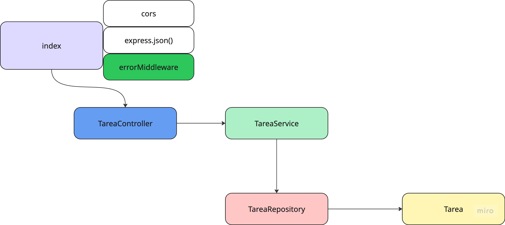

## Tareas de un equipo de desarrollo

[](https://github.com/uqbar-project/eg-tareas-node/actions/workflows/build.yml) [](https://codecov.io/gh/uqbar-project/eg-tareas-node)

## Colecciones de prueba

- [Bruno](./manualTest/Tareas_Bruno.json)
- [POSTMAN](./manualTest/Tareas_Postman.json)

## Configuración inicial

Antes de levantar el servidor, asegurate de tener instalado Node.js y las dependencias del proyecto.

### Instalar Node.js con nvm (opcional)

Si usás nvm para manejar versiones de Node.js:

```bash
nvm use
```

Esto seleccionará automáticamente la versión de Node.js especificada en el archivo `.nvmrc` del proyecto.

### Instalar dependencias

```bash
pnpm install
```

## Cómo levantar el servidor

### Modo desarrollo (con watch)

```bash
pnpm start:dev
```

### Tests

```bash
pnpm test
```

### Linter

```bash
pnpm lint
```

## Explicación general

En esta variante en Node agregamos servicios de paginación para lo cual, a la hora de pedir las tareas, agregamos como parámetro

- el número de la página
- y el límite de tareas por página

De esa manera, si pedimos la página 1 y el límite de 10, el servicio nos devolverá las primeras 10 tareas.
Si pedimos la página 2 y el límite de 10, el servicio nos devolverá las siguientes 10 tareas (de la 11 a la 20 si tenemos).

Como respuesta recibimos:

- el número de página
- si hay más tareas
- y la lista de tareas para dicha página

Ejemplo:

```json
{
  "page": 1,
  "hasMore": true,
  "data": [
    {
      "id": 1,
      "descripcion": "Adfectus cibo contra talus adiuvo.",
      "iteracion": "Sprint 3",
      "asignadoA": "Barbara Arroyo Montemayor",
      "fecha": "13/10/2025",
      "porcentajeCumplimiento": 48
    },
```

## Los endpoints

- Buscar tareas paginadas
- Buscar una tarea
- Actualizar una tarea: la fecha, el porcentaje de cumplimiento y el asignatario
- Buscar usuarios

## Implementación

El proyecto está implementado con **NestJS**, un framework progresivo de Node.js que usa decorators para estructurar la aplicación. La arquitectura sigue el patrón **Controller → Service → Repository** con inyección de dependencias automática.

### Estructura del proyecto

```
src/
├── main.ts                        # Entry point con NestFactory
├── app.module.ts                  # Módulo raíz
├── tarea/
│   ├── tarea.module.ts
│   ├── tarea.controller.ts        # @Controller('tareas')
│   ├── tarea.service.ts           # @Injectable()
│   └── tarea.repository.ts
├── usuario/
│   ├── usuario.module.ts
│   ├── usuario.controller.ts      # @Controller('usuarios')
│   ├── usuario.service.ts         # @Injectable()
│   └── usuario.repository.ts
└── domain/
    └── tarea.ts                   # Clases Tarea y Usuario
```

### Arquitectura general



El **main.ts** arranca la aplicación con `NestFactory.create(AppModule)`, habilita CORS y expone el servidor.

Cada módulo agrupa controller, service y repository con la misma separación de responsabilidades que podés encontrar en el ejemplo [implementado en Springboot](https://github.com/uqbar-project/eg-tareas-springboot-kotlin):

- **controller**: adapta el pedido HTTP usando decorators como `@Get`, `@Put`, `@Param`, `@Body` y `@Query`
- **service**: orquesta las llamadas al repositorio y delega la conversión a objetos de dominio
- **repository**: servicio de acceso a los datos (en memoria con datos generados por `faker`)
- **domain**: objetos de negocio `Tarea` y `Usuario`

### Inyección de dependencias

NestJS usa un contenedor de DI similar al `@Autowired` de Springboot. Los servicios y repositorios se decoran con `@Injectable()` y se inyectan por constructor:

```ts
// tarea.service.ts
@Injectable()
export class TareasService {
  constructor(
    private readonly tareaRepository: TareaRepository,
    private readonly usuarioRepository: UsuarioRepository,
  ) {}

  async getTareaById(id: number) {
    const tarea = await this.tareaRepository.getTareaById(id)
    if (!tarea) throw new NotFoundException(`Tarea ${id} no encontrada`)
    return tarea.toDto()
  }
}
```

```ts
// tarea.controller.ts
@Controller('tareas')
export class TareaController {
  constructor(private readonly tareasService: TareasService) {}

  @Get()
  async getTareas(@Query('page') page?: string, @Query('limit') limit?: string) {
    const pageNum = page ? Number(page) : 1
    const limitNum = limit ? Number(limit) : 0
    return this.tareasService.getTareas(pageNum, limitNum)
  }
}
```

### Módulos y dependencias entre módulos

**`AppModule`** es el módulo raíz. Su única responsabilidad es importar los demás módulos:

```ts
@Module({
  imports: [TareaModule, UsuarioModule],
})
export class AppModule {}
```

Cada módulo define sus propios componentes y decide qué compartir con otros módulos mediante `exports`.

**`UsuarioModule`** exporta `UsuarioRepository` para que esté disponible en otros módulos:

```ts
@Module({
  controllers: [UsuarioController],
  providers: [UsuariosService, UsuarioRepository],
  exports: [UsuarioRepository],
})
export class UsuarioModule {}
```

**`TareaModule`** importa `UsuarioModule` para poder inyectar `UsuarioRepository` en sus servicios:

```ts
@Module({
  imports: [UsuarioModule],
  controllers: [TareaController],
  providers: [TareasService, TareaRepository],
})
export class TareaModule {}
```

La regla es simple: si el módulo A necesita un provider del módulo B, entonces A importa a B, y B tiene que exportar ese provider.

```
AppModule
 ├── TareaModule
 │    ├── TareaController  →  TareasService
 │    ├── TareasService    →  TareaRepository + UsuarioRepository (exportado de UsuarioModule)
 │    └── TareaRepository
 │
 └── UsuarioModule (exports: UsuarioRepository)
      ├── UsuarioController  →  UsuariosService
      ├── UsuariosService    →  UsuarioRepository
      └── UsuarioRepository
```

> A diferencia de Springboot — donde todo es global por defecto gracias al classpath scanning — NestJS exige declarar `imports` y `exports` explícitamente. Es más verboso pero evita dependencias ocultas. Es una decisión de diseño distinta: encapsulación por módulo.

### Manejo de errores

NestJS provee excepciones built-in que llevan asociado su código HTTP. Al lanzarlas, NestJS las intercepta y devuelve la respuesta adecuada sin necesidad de filters ni middlewares:

| Excepción | Status code |
|---|---|
| `NotFoundException` | 404 |
| `BadRequestException` | 400 |
| `InternalServerErrorException` | 500 |

```ts
// tarea.service.ts
import { Injectable, NotFoundException } from '@nestjs/common'

@Injectable()
export class TareasService {
  async getTareaById(id: number) {
    const tarea = await this.tareaRepository.getTareaById(id)
    if (!tarea) throw new NotFoundException(`Tarea ${id} no encontrada`)
    return tarea.toDto()
  }
}
```

### Generación de datos de prueba

La biblioteca `faker` nos sirve para crear primero 50 usuarios y luego 450 tareas. A diferencia de la versión anterior con Express, ahora todo se genera de forma sincrónica al iniciar el módulo:

```ts
const crearUsuarioFalso = (): Usuario => {
  const usuario = new Usuario()
  usuario.id = faker.string.uuid()
  usuario.nombre = faker.person.fullName()
  usuario.email = faker.internet.email()
  return usuario
}

const generarUsuarios = (cantidad: number = 50) =>
  Array.from({ length: cantidad }, crearUsuarioFalso)

@Injectable()
export class UsuarioRepository {
  private usuarios: Usuario[] = generarUsuarios()
```

```ts
let ultimoId = 1

const crearTareaFalsa = (): Tarea => {
  const tarea = new Tarea()
  tarea.id = ultimoId++
  tarea.descripcion = faker.lorem.sentence(5)
  tarea.iteracion = `Sprint ${faker.number.int({ min: 1, max: 4 })}`
  tarea.fecha = faker.date.recent({ days: 30 })
  tarea.porcentajeCumplimiento = faker.number.int({ min: 0, max: 100 })
  return tarea
}

const generarTareas = (cantidad: number = 10): Tarea[] =>
  Array.from({ length: cantidad }, crearTareaFalsa)

@Injectable()
export class TareaRepository {
  private tareas: Tarea[] = generarTareas(450)
```

Al ser datos en memoria, el servidor arranca con datos precargados listos para consultar y modificar.
