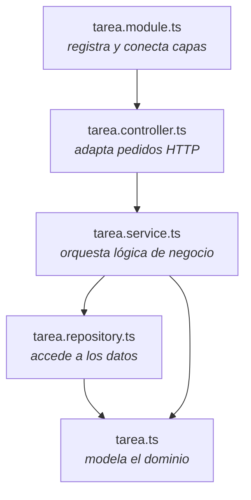

## Tareas de un equipo de desarrollo - Paginado con Nest

[](https://github.com/uqbar-project/eg-tareas-node/actions/workflows/build.yml) [](https://codecov.io/gh/uqbar-project/eg-tareas-node)

## Colecciones de prueba

- [Bruno](./manualTest/Tareas_Bruno.json)
- [POSTMAN](./manualTest/Tareas_Postman.json)

## Configuración inicial

Antes de levantar el servidor, asegurate de tener instalado Node.js y las dependencias del proyecto.

### Instalar Node.js con nvm (opcional)

Si usás nvm para manejar versiones de Node.js:

```bash
nvm use
```

Esto seleccionará automáticamente la versión de Node.js especificada en el archivo `.nvmrc` del proyecto.

### Instalar dependencias

```bash
pnpm install
```

## Cómo levantar el servidor

### Modo desarrollo (con watch)

```bash
pnpm start:dev
```

### Tests

```bash
pnpm test
```

### Linter

```bash
pnpm lint
```

## Explicación general

En esta variante en Node agregamos servicios de paginación para lo cual, a la hora de pedir las tareas, agregamos como parámetro

- el número de la página
- y el límite de tareas por página

De esa manera, si pedimos la página 1 y el límite de 10, el servicio nos devolverá las primeras 10 tareas.
Si pedimos la página 2 y el límite de 10, el servicio nos devolverá las siguientes 10 tareas (de la 11 a la 20 si tenemos).

Como respuesta recibimos:

- el número de página
- si hay más tareas
- y la lista de tareas para dicha página

Ejemplo:

```json
{
  "page": 1,
  "hasMore": true,
  "data": [
    {
      "id": 1,
      "descripcion": "Adfectus cibo contra talus adiuvo.",
      "iteracion": "Sprint 3",
      "asignadoA": "Barbara Arroyo Montemayor",
      "fecha": "13/10/2025",
      "porcentajeCumplimiento": 48
    },
```

## Los endpoints

- Buscar tareas paginadas
- Buscar una tarea
- Actualizar una tarea: la fecha, el porcentaje de cumplimiento y el asignatario
- Buscar usuarios

## Implementación

El proyecto está implementado con **NestJS**, un framework progresivo de Node.js que usa decorators para estructurar la aplicación. La arquitectura sigue el patrón **Controller → Service → Repository** con inyección de dependencias automática.

### Estructura del proyecto

```
src/
├── main.ts                        # Entry point con NestFactory
├── app.module.ts                  # Módulo raíz
├── tarea/
│   ├── tarea.module.ts
│   ├── tarea.controller.ts        # @Controller('tareas')
│   ├── tarea.service.ts           # @Injectable()
│   └── tarea.repository.ts
├── usuario/
│   ├── usuario.module.ts
│   ├── usuario.controller.ts      # @Controller('usuarios')
│   ├── usuario.service.ts         # @Injectable()
│   └── usuario.repository.ts
└── domain/
    └── tarea.ts                   # Clases Tarea y Usuario
```

### Arquitectura general


```mermaid
graph TD
    tarea.module.ts["tarea.module.ts<br/><i>registra y conecta capas</i>"]
    tarea.controller.ts["tarea.controller.ts<br/><i>adapta pedidos HTTP</i>"]
    tarea.service.ts["tarea.service.ts<br/><i>orquesta lógica de negocio</i>"]
    tarea.repository.ts["tarea.repository.ts<br/><i>accede a los datos</i>"]
    tarea.ts["tarea.ts<br/><i>modela el dominio</i>"]

    tarea.module.ts --> tarea.controller.ts
    tarea.controller.ts --> tarea.service.ts
    tarea.service.ts --> tarea.repository.ts
    tarea.repository.ts --> tarea.ts
    tarea.service.ts --> tarea.ts
```

El **main.ts** arranca la aplicación con `NestFactory.create(AppModule)`, habilita CORS y expone el servidor.

Cada módulo agrupa controller, service y repository con la misma separación de responsabilidades que podés encontrar en el ejemplo [implementado en Springboot](https://github.com/uqbar-project/eg-tareas-springboot-kotlin):

- **controller**: adapta el pedido HTTP usando decorators como `@Get`, `@Put`, `@Param`, `@Body` y `@Query`
- **service**: orquesta las llamadas al repositorio y delega la conversión a objetos de dominio
- **repository**: servicio de acceso a los datos (en memoria con datos generados por `faker`)
- **domain**: objetos de negocio `Tarea` y `Usuario`

### Inyección de dependencias

NestJS usa un contenedor de Dependency Injection similar al `@Autowired` de Springboot. Los servicios y repositorios se decoran con `@Injectable()` y se inyectan por constructor:

```ts
// tarea.controller.ts
@Controller('tareas')
export class TareaController {
  constructor(private readonly tareasService: TareasService) {}

  @Get()
  async getTareas(@Query('page') page?: string, @Query('limit') limit?: string) {
    const pageNum = page ? Number(page) : 1
    const limitNum = limit ? Number(limit) : 0
    return this.tareasService.getTareas(pageNum, limitNum)
  }
}
```

En este ejemplo vemos que

- el decorator `@Get()` le avisa a Nest que el método reacciona ante un método http GET
- page y limit son _query params_, que se pasan mediante la URL: `tareas?page=1&limit=5`. Para eso utilizamos el decorator `@Query`. Esos parámetros son opcionales, les proveemos valores default
- y finalmente... delegamos al service: el lector podrá ver que se inyecta **por constructor** en el controller
- y también pueden ver cómo se arma la paginación en el archivo [tareas.service.ts](./src/tarea/tarea.service.ts), un método _async_ para imitar el comportamiento que tendría una aplicación real que en lugar de tener un repositorio en memoria trabaje con una base de datos.

### Módulos y dependencias entre módulos

**`AppModule`** es el módulo raíz. Su única responsabilidad es importar los demás módulos:

```ts
@Module({
  imports: [TareaModule, UsuarioModule],
})
export class AppModule {}
```

Cada módulo define sus propios componentes y decide qué compartir con otros módulos mediante `exports`.

**`UsuarioModule`** exporta `UsuarioRepository` para que esté disponible en otros módulos:

```ts
@Module({
  controllers: [UsuarioController],
  providers: [UsuariosService, UsuarioRepository],
  exports: [UsuarioRepository],
})
export class UsuarioModule {}
```

**`TareaModule`** importa `UsuarioModule` para poder inyectar `UsuarioRepository` en sus servicios:

```ts
@Module({
  imports: [UsuarioModule],
  controllers: [TareaController],
  providers: [TareasService, TareaRepository],
})
export class TareaModule {}
```

La regla es simple: si el módulo A necesita un provider del módulo B, entonces A importa a B, y B tiene que exportar ese provider.

```
AppModule
 ├── TareaModule
 │    ├── TareaController  →  TareasService
 │    ├── TareasService    →  TareaRepository + UsuarioRepository (exportado de UsuarioModule)
 │    └── TareaRepository
 │
 └── UsuarioModule (exports: UsuarioRepository)
      ├── UsuarioController  →  UsuariosService
      ├── UsuariosService    →  UsuarioRepository
      └── UsuarioRepository
```

> A diferencia de Springboot — donde todo es global por defecto gracias al classpath scanning — NestJS exige declarar `imports` y `exports` explícitamente. Es más verboso pero evita dependencias ocultas. Es una decisión de diseño distinta: encapsulación por módulo.

### Manejo de errores

NestJS provee excepciones built-in que llevan asociado su código HTTP. Al lanzarlas, NestJS las intercepta y devuelve la respuesta adecuada sin necesidad de filters ni middlewares:

| Excepción | Status code |
|---|---|
| `NotFoundException` | 404 |
| `BadRequestException` | 400 |
| `InternalServerErrorException` | 500 |

```ts
// tarea.service.ts
import { Injectable, NotFoundException } from '@nestjs/common'

@Injectable()
export class TareasService {
  async getTareaById(id: number) {
    const tarea = await this.tareaRepository.getTareaById(id)
    if (!tarea) throw new NotFoundException(`Tarea ${id} no encontrada`)
    return tarea.toDto()
  }
}
```

### Generación de datos de prueba

La biblioteca `faker` nos sirve para crear primero 50 usuarios y luego 450 tareas:
```ts
const crearUsuarioFalso = (): Usuario => {
  const usuario = new Usuario()
  usuario.id = faker.string.uuid()
  usuario.nombre = faker.person.fullName()
  usuario.email = faker.internet.email()
  return usuario
}

const generarUsuarios = (cantidad: number = 50) =>
  Array.from({ length: cantidad }, crearUsuarioFalso)

@Injectable()
export class UsuarioRepository {
  private usuarios: Usuario[] = generarUsuarios()
```

Lo mismo ocurre con el repositorio de tareas. Al ser datos en memoria, el servidor arranca con datos precargados listos para consultar y modificar.

### Testeo de integración

Usamos **Vitest** como test runner junto con **`@nestjs/testing`** y **Supertest**. La idea es levantar el módulo completo sin iniciar un servidor real: `Test.createTestingModule()` instancia el contenedor de NestJS con todos sus providers, y `supertest` dispara pedidos HTTP contra ese módulo como si fuera un servidor real.

```ts
import { type INestApplication } from '@nestjs/common'
import { Test, type TestingModule } from '@nestjs/testing'
import request from 'supertest'
import { afterEach, beforeEach, describe, expect, it } from 'vitest'
import { AppModule } from '../../src/app.module.js'

describe('API integration tests', () => {
  let app: TestingModule
  let nestApp: INestApplication

  beforeEach(async () => {
    app = await Test.createTestingModule({
      imports: [AppModule],
    }).compile()
    nestApp = app.createNestApplication()
    await nestApp.init()
  })

  afterEach(async () => {
    await nestApp.close()
  })

  it('GET /tareas should return page and data array', async () => {
    const res = await request(nestApp.getHttpServer()).get('/tareas')
    expect(res.status).toBe(200)
    expect(res.body).toHaveProperty('page')
    expect(Array.isArray(res.body.data)).toBe(true)
    expect(res.body.page).toBe(1)
  })

  it('GET /tareas/:id and PUT /tareas/:id should return and update a task', async () => {
    const listRes = await request(nestApp.getHttpServer()).get('/tareas')
    const id = listRes.body.data[0].id

    const getRes = await request(nestApp.getHttpServer()).get(`/tareas/${id}`)
    expect(getRes.status).toBe(200)

    const updatedDto = {
      ...getRes.body,
      descripcion: 'Descripcion actualizada desde test',
    }
    const putRes = await request(nestApp.getHttpServer())
      .put(`/tareas/${id}`)
      .send(updatedDto)
    expect(putRes.status).toBe(200)
    expect(putRes.body.descripcion).toBe('Descripcion actualizada desde test')
  })
})
```

Cada test levanta y cierra la aplicación (`beforeEach` / `afterEach`) para garantizar aislamiento. Como el repositorio vive en memoria, no se necesita base de datos ni fixtures externos. El test de actualización primero consulta la lista para obtener un `id` real, luego hace GET y finalmente PUT, verificando que la descripción se persistió.
